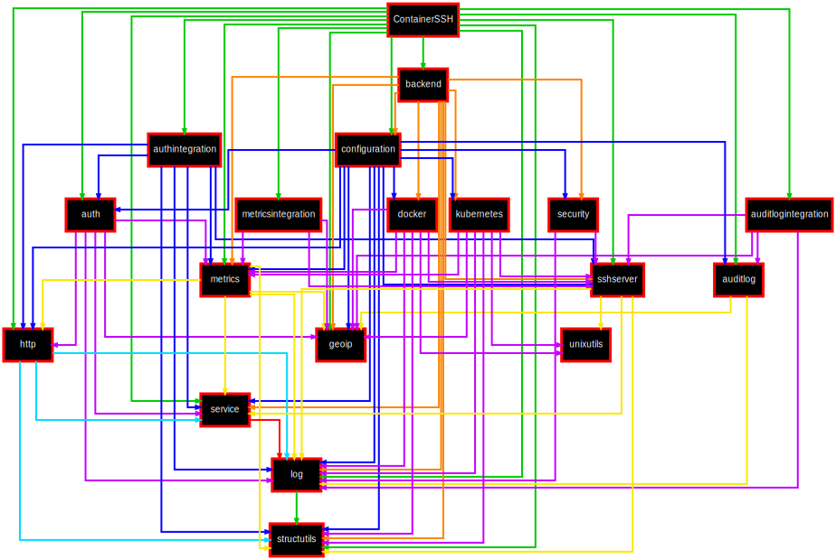

<h1>Internal Architecture</h1>

The ContainerSSH internal architecture consists of two main parts: the SSH server and the backends.

The SSH server is located in the `github.com/containerssh/containerssh/ssh`. The server can be instantiated using the `NewServer()` method.

This method will take an implementation of the authentication client that is performing the authentication. The interface for the client is defined in [`github.com/containerssh/containerssh/auth`](https://github.com/ContainerSSH/ContainerSSH/tree/stable/auth). It must implement two methods for password and public key authentication.

It will also take a client implementation for the configuration. The interface is defined in [`github.com/containerssh/containerssh/config/client`](https://github.com/ContainerSSH/ContainerSSH/tree/stable/config/client). It must implement a single method to fetch the configuration.

The final significant method is the backend registry. The backend is fetched based on the configuration in the config file or from the config server.

The backend is a structure of `Backend` defined in [`github.com/containerssh/containerssh/backend/`](https://github.com/ContainerSSH/ContainerSSH/tree/stable/backend). The `CreateSession` method takes the details of the current connection and returns a session implementation.

The session implementation defines the handler methods for individual SSH events like setting environment variables or executing commands. 

## Module dependency map

The following graph shows the internal dependencies of ContainerSSH. This is important to know the order in which modules must be updated:

